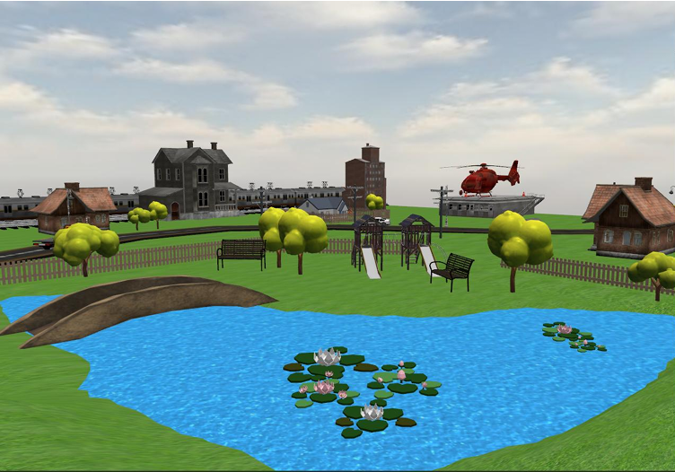

 In this project, I created a 3D, photorealistic scene using OpenGL, GLFW, and GLM libraries for rendering and real-time manipulation. The scene can be explored through user interaction, using the mouse and keyboard.
 The project aims to simulate a scene as close to reality as possible, including various light sources, textured materials, and dynamic animations of objects

